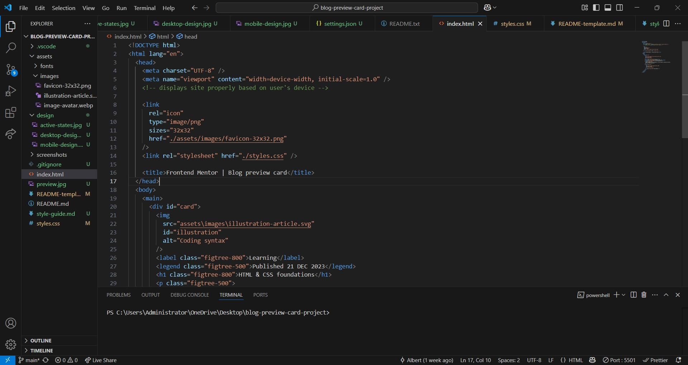
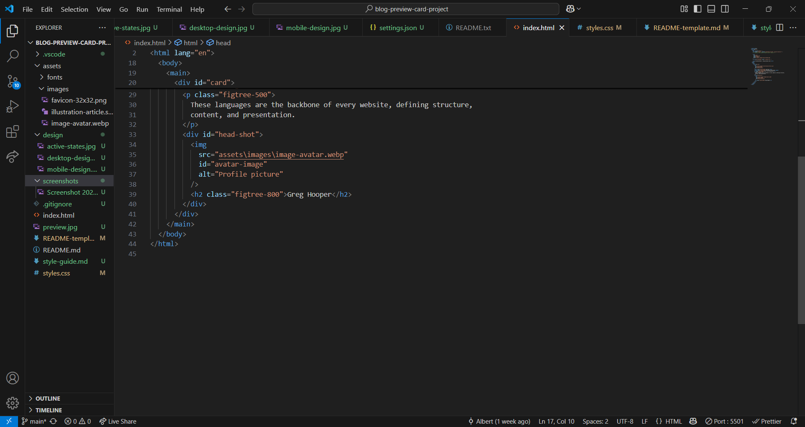
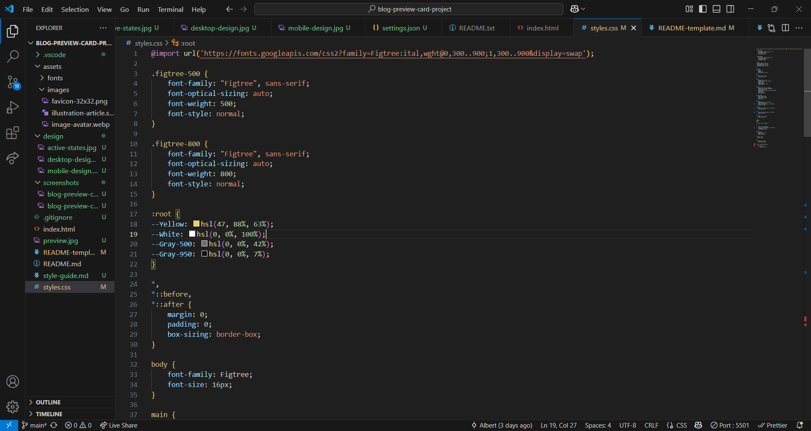
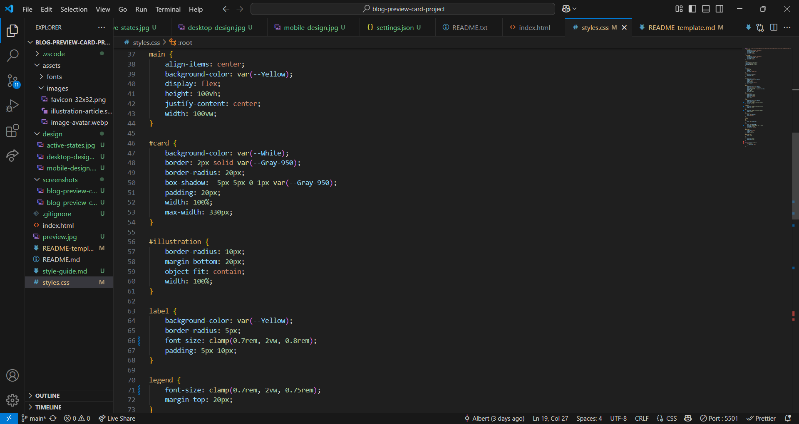
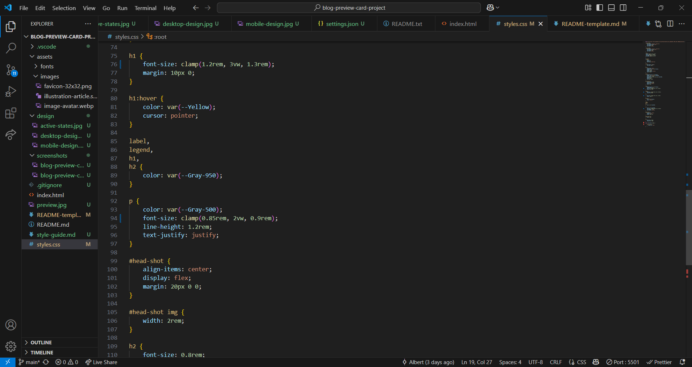

# Frontend Mentor - Blog preview card solution

This is a solution to the [Blog preview card challenge on Frontend Mentor](https://www.frontendmentor.io/challenges/blog-preview-card-ckPaj01IcS). Frontend Mentor challenges help you improve your coding skills by building realistic projects.

## Table of contents

- [Overview](#overview)
  - [The challenge](#the-challenge)
  - [Screenshot](#screenshot)
  - [Links](#links)
- [My process](#my-process)
  - [Built with](#built-with)
  - [What I learned](#what-i-learned)
  - [Continued development](#continued-development)
  - [Useful resources](#useful-resources)
- [Author](#author)
- [Acknowledgments](#acknowledgments)

## Overview

My solution and process used to complete the Frontend Mentor Blog Preview Card project.

### The challenge

Users should be able to:

- See hover and focus states for all interactive elements on the page

### Screenshot









### Links

- Solution URL: [GitHub @BertSki90](https://github.com/BertSki90/blog-preview-card-project)
- Live Site URL: [GitHub Pages @BertSki90](https://bertski90.github.io/blog-preview-card-project/)

## My process

- HTML, Set up HTML structure. First the card was created. Starting from the top of the card and working down, the elements were structured in that order. The last 2 elements were put in a div element to keep them together for styling purposes.

- CSS, Start with getting image element to fit inside of the card. Then set the profile picture and name inline with each other to better visualize the styling. The colors, font size, and fonts were added to the stylesheet and applied to the HTML following the instructions from the style guide. All the elements were then styled working from top of the screen to bottom.

- CSS touchups, The same image needed to appear slightly different on the mobile version than on the desktop version. Replacing font-size values to match the design while being responsive to the size of the screen.

### Built with

- Semantic HTML5 markup
- CSS custom properties
- Flexbox
- Mobile-first workflow

### What I learned

For inline dislay the margin top and bottom properties do not work.

The clamp() value which helps the text become responsive, see below:

```html
<label class="figtree-800">Learning</label>
```

```css
label {
  background-color: var(--Yellow);
  border-radius: 5px;
  font-size: clamp(0.7rem, 2vw, 0.8rem);
  padding: 5px 10px;
}
```

To get the image to appear slightly different on a mobile screen, see below:

```html

```

```css
@media (max-width: 480px) {
  #illustration {
    object-fit: none;
  }
}
```

To achieve having the avatar picture and name next to each other and vertically centering the name inside of the element, see below:

```html
<div id="head-shot">
  
  <h2 class="figtree-800">Greg Hooper</h2>
</div>
```

```css
#head-shot {
  align-items: center;
  display: flex;
  margin: 20px 0 0;
}
```

### Continued development

To get better at working with images.

### Useful resources

- [Web3Schools](https://www.w3schools.com/css/css3_object-fit.asp) - Clearifies the object-fit properties and values. It made working with the top image easier.
- [Web3Schools](https://www.w3schools.com/cssref/css3_pr_box-shadow.php) - Great guidance for using the box-shadow property.
- [Web3Schools](https://www.w3schools.com/cssref/css3_pr_text-justify.php) - How to justify text.
- [FreeCodeCamp](https://www.freecodecamp.org/news/css-media-queries-breakpoints-media-types-standard-resolutions-and-more/) - Provide clear breakpoionts for different sizes of screens.
- [YouTube, DesignCourse](https://www.youtube.com/watch?time_continue=300&v=dg488RrpNTc&embeds_referring_euri=https%3A%2F%2Fforum.freecodecamp.org%2F&source_ve_path=MzY4NDIsMzY4NDIsMzY4NDIsMjg2NjY) - The video had great insights on how to make the text responsive using the clamp as the value for font-size. The premise is like so, "font-size: clamp(min size, growth in vw, max size);".

## Author

- Website - [GitHub @BertSki90](https://bertski90.github.io/blog-preview-card-project/)
- Frontend Mentor - [@BertSki90](https://www.frontendmentor.io/profile/@BertSki90)
- Twitter - [@BertSki90](https://www.x.com/@BertSki90)

## Acknowledgments

I would like to thank the FreeCodeCamp team that has a great curicculum, resources and community. A shout out to Frontend Mentor for giving me a place to practice what I have learnt. Thank you guys so much!
